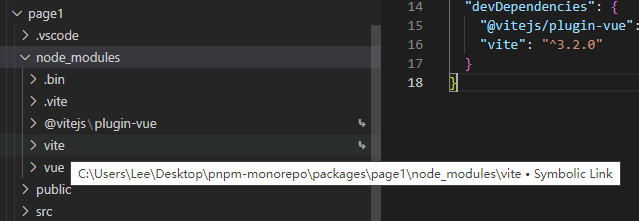
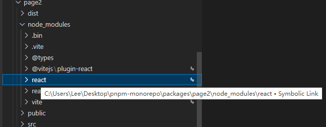
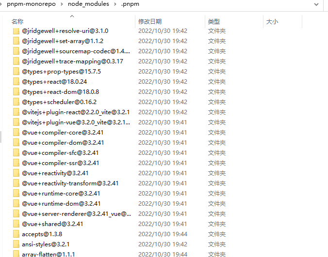

# pnpm monorepo

## 步骤

### 1. 初始化工程

```bash
pnpm init
```

### 2. 创建 `pnpm-workspace.yaml`

```yaml
packages:
  - 'packages/**'
```

### 3. 创建 `packages/common`

导出方法

```js
export default function printPoem(num) {
  console.log("可怜白骨攒孤冢，尽为将军觅战功。", num);
}
```

修改 `package.json`

```json
{
    "type": "module",
}
```

### 4. 创建 `packages/page1`

```bash
# vue项目
pnpm create vite page1

cd page1
pnpm install

# 修改vite.config.js运行在3001端口
pnpm run dev
```

### 5. 创建 `packages/page2`

```bash
# react项目
pnpm create vite page2

cd page2
pnpm install

# 修改vite.config.js运行在3002端口
pnpm run dev
```

### 6. 创建 `packages/server`

```bash
pnpm install common
pnpm install express
```

可以看到如果依赖的是当前项目的模块，版本号会有 `workspace:` 前缀

```json
{
    "dependencies": {
    	"common": "workspace:^1.0.0",
    	"express": "^4.18.2"
  	}
}
```

`src/index.js`

```js
import printPoem from "common";
import express from "express";
import _ from "lodash";

// 可以使用项目共享的lodash依赖以及当前项目的模块依赖
printPoem(_.random(10, 20));

const app = express();
const port = 8080;

app.all("*", function (req, res, next) {
  res.header("Access-Control-Allow-Host", "*");
  res.header("Access-Control-Allow-Origin", "*");
  res.header("Access-Control-Allow-Methods", "PUT,POST,GET,DELETE,OPTIONS");
  next();
});

app.get("/", (req, res) => {
  res.send("Hello world!");
});

app.listen(port, () => {
  console.log(`App listening on port ${port}`);
});
```


## 观察依赖提升





